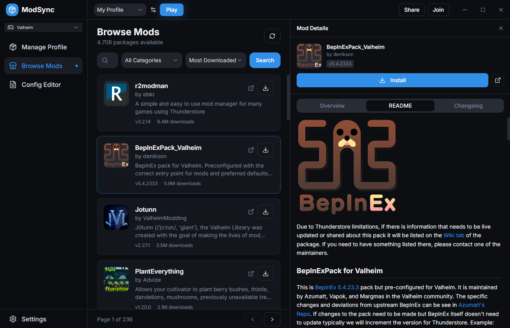

# Mod Updater

A lightweight mod updater for some Steam games built with [Tauri 2.0](https://beta.tauri.app/guides/).

## Overview

This project simplifies the process of managing and syncing mods with friends for supported Steam games.

## Features

- Browse and install mods from Thunderstore
- Automatic mod updates
- Profile management (multiple mod configurations per game)
- Sync mods and configs with friends
- Simple and intuitive interface

## Usage

1. Clone this repository.
2. Install dependencies with `bun install` and run the project using `bun tauri dev`.
3. Select your game, create a profile, and start managing your mods.

_**Note:** You can also use the [release](https://github.com/Frenvius/tauri-mod-updater/releases) version._
